# 🌉 VerbaBridge (Backend)

**The Linguistic Bridge for Cultural Preservation & Digital Inclusion**

VerbaBridge is a powerful FastAPI backend designed to break down cultural and generational language barriers.

## 📚 API Architecture

**Analogy & Translation Endpoints:**

- `POST /generate_analogy` — Takes a slang word and generates personalized cultural analogies based on the user's generation, vibe/dialect, and preferred language.

- `POST /live_translate` — Translates slang text into polite, senior-friendly language in real time.

- `POST /live_translate_audio` — Receives an audio file (m4a), sends it to Gemini for transcription, and returns the transcription + translated text.

- `POST /generate_analogy_audio` — Receives an audio file and directly returns Analogy swipe card data (one-shot voice lookup).

- `GET /api/tts` — Text-to-Speech: Generates audio from text using Gemini and returns raw PCM audio bytes.

**User Data Endpoints:**

- `POST /api/save_word` — Saves a slang word, its literal translation, and successful analogy to the user's vocabulary book in Firestore.

- `GET /api/get_words/{user_id}` — Retrieves all saved words for a user, sorted by newest first.

## 🏗️ Technical Architecture

```mermaid
flowchart TB
    subgraph Client["📱 Flutter Mobile App"]
        UI["UI Layer<br/>(Translate Tab, My Words, Profile)"]
        API_SVC["ApiService<br/>(HTTP Client)"]
        AUTH["Firebase Auth<br/>(Google Sign-In)"]
        AUDIO_REC["Audio Recorder<br/>(record package)"]
        AUDIO_PLAY["Audio Player<br/>(audioplayers + WAV wrapper)"]
    end

    subgraph Server["⚙️ FastAPI Backend"]
        ROUTES["FastAPI Routes<br/>(main.py)"]
        AI_MOD["AI Module<br/>(core/ai.py)"]
        STYLE_MOD["Style Module<br/>(core/style.py)"]
        CACHE_MOD["Cache Layer<br/>(core/cache.py)"]
        TTS_MOD["TTS Engine<br/>(Gemini Native Audio)"]
    end

    subgraph External["☁️ External Services"]
        GEMINI["Google Gemini 3.0<br/>(Flash Preview)"]
        FIRESTORE["Firebase Firestore"]
        CF["Cloudflare Tunnel"]
    end

    UI --> API_SVC
    UI --> AUTH
    UI --> AUDIO_REC
    UI --> AUDIO_PLAY
    API_SVC -->|HTTPS| CF -->|localhost:8000| ROUTES
    ROUTES --> AI_MOD --> GEMINI
    ROUTES --> STYLE_MOD --> GEMINI
    ROUTES --> CACHE_MOD
    ROUTES --> TTS_MOD --> GEMINI
    ROUTES -->|save/get words| FIRESTORE
    AUTH -->|sign-in| FIRESTORE
```



**Data Flow:**

1. User types slang or records audio → Flutter sends request via `ApiService`
2. Request travels through Cloudflare Tunnel to local FastAPI server
3. Server checks the `FileSystemCache` (MD5-hashed JSON files) for cached responses
4. On cache miss, the Gemini 3.0 Flash model processes the request with culturally-tuned prompts
5. Response is cached and returned to Flutter for display as swipeable analogy cards

## 🔧 Implementation Details

### Gemini-Powered Analogy Engine (`core/ai.py`)

The core of VerbaBridge is the **"Rizzeta Stone" Protocol** — a carefully engineered prompt framework that instructs Gemini to act as a "GenBridge Linguistic Anthropologist." Key design choices:

- **Generation-aware analogies:** The prompt dynamically adjusts its references based on the user's selected generation (Boomer, Gen X, Millennial, Gen Z, Gen Alpha), producing culturally relevant comparisons
- **Dialect/vibe system:** Supports cultural personas like "Ah Beng (Penang Hokkien)" and "Mak Cik Bawang (Dramatic Gossip)" that influence the tone and vocabulary of translations
- **Multilingual output:** Responses are generated natively in English, Chinese (漢字/Hanzi), or Malay based on user preference
- **Structured JSON output:** Uses Gemini's `response_mime_type="application/json"` to guarantee parseable responses with `slang_detected`, `literal_translation`, `analogies[]`, and `ambiguity_warning`

### Smart Edge Caching (`core/cache.py`)

A dual-mode `FileSystemCache` system optimizes API quota usage:

- **Directory Mode (default):** Each unique query combination (`slang|generation|vibe|language`) is normalized, MD5-hashed, and stored as individual JSON files in `cache_data/`. This allows O(1) lookups without loading the entire cache into memory
- **Single File Mode:** An alternative mode for simpler key-value lookups (e.g., OCR translations), storing everything in one JSON map file

### Audio Pipeline

The audio system involves two distinct paths:

- **Recording:** Flutter's `record` package captures audio as `.m4a` (AAC-LC codec), which is uploaded as `multipart/form-data` to the server
- **Transcription + Translation:** Gemini 3.0 Flash processes raw audio bytes with `Part.from_bytes()`, performing transcription and cultural translation in a single inference call
- **Text-to-Speech:** Gemini's native audio modality generates speech from analogy text. The server returns raw PCM audio (`audio/L16` at 24kHz), which the Flutter client wraps with a WAV header before playback via `audioplayers`

### Flutter Frontend Architecture

- **State management:** Uses `StatefulWidget` with `TickerProviderStateMixin` for animation controllers (mic pulse, glow effects)
- **Mode system:** Lookup mode (single word → analogy cards) and Live mode (continuous conversation translation) share the same language selector and mic infrastructure
- **Swipe cards:** Custom gesture-based card system with drag physics, rotation transforms, and directional actions (left = next card, right = save to Firestore)

## 🧗 Challenges Faced

### 1. Raw PCM Audio Playback
Gemini's TTS API returns raw PCM audio data (`audio/L16` at 24kHz) without headers. The `audioplayers` package cannot play headerless PCM streams. **Solution:** We implemented a `_createWavHeader()` function that generates a standard 44-byte WAV header and prepends it to the raw PCM bytes before playback using `BytesSource`.

### 2. Prompt Engineering for Cultural Accuracy
Getting Gemini to consistently produce culturally accurate analogies across three languages and multiple dialects required extensive prompt iteration:
- **Zero Drop Rule:** Early prompts would silently drop English names/titles when translating to Chinese or Malay
- **Identity Rule:** The model would unnecessarily paraphrase text that was already polite and in the correct language
- **Native Script Enforcement:** Without explicit instructions, the model would romanize Chinese output (Pinyin) instead of using Hanzi characters

### 3. Audio MIME Type Handling
Flutter's HTTP client sends recorded audio files with a generic `application/octet-stream` content type. Gemini requires a proper audio MIME type to process the file. **Solution:** Server-side MIME type detection with forced fallback to `audio/mp4` for `.m4a` files.

### 4. Cache Key Normalization
Case-sensitivity and whitespace differences caused cache misses for identical queries. **Solution:** Input normalization (lowercase + trim) before MD5 hashing ensures "Skibidi" and "skibidi" hit the same cache entry.

## 🛠️ Local Setup Instructions

Clone the repository

```bash
git clone https://github.com/lkaixian/verbabridge.git
cd verbabridge/server
```

**Server Side**

1. Install dependencies

```bash
pip install -r requirements.txt
```

2. Configure Environment Variables & Secrets

- Create a .env file in the ./server directory and add your Gemini API Key:

```bash
GEMINI_API_KEY=your_api_key_here
```

- Firebase Setup: Place your serviceAccountKey.json in the root directory.

(Note: For security reasons, this file is intentionally excluded via .gitignore and must be generated via the Firebase Console).

3. Setup cloudflared tunnel for external access.

Prerequisite: This step require a valid domain and a cloudflare account in order to work it out.

**Windows:**

```bash
# 1. Install cloudflared using Chocolatey (Requires Admin privileges)
choco install cloudflared -y

# 2. Authenticate your machine with Cloudflare 
# (This will pop open a browser window to select your domain)
cloudflared tunnel login

# 3. Create the named tunnel for your backend
# Copy that UUID, you will need it for the config file!
cloudflared tunnel create verbabridge

# 4. Route the DNS to your Cloudflare domain
# Replace 'api.yourdomain.com' with the actual domain you own on Cloudflare
cloudflared tunnel route dns verbabridge api.yourdomain.com

# 5. Create the routing configuration file (config.yml)
# Replace <YOUR_UUID>, <YOUR_WINDOWS_USERNAME>, and <api.yourdomain.com>
cat <<EOF > config.yml
tunnel: <YOUR_UUID>
credentials-file: C:\Users\<YOUR_WINDOWS_USERNAME>\.cloudflared\<YOUR_UUID>.json

ingress:
  - hostname: <api.yourdomain.com>
    service: http://localhost:8000
  - service: http_status:404
EOF

# 6. Spin up the tunnel!
# This reads your config.yml and wires your local FastAPI server to the internet
cloudflared tunnel run verbabridge
```

**Linux:**

```bash
# 1. Download and install cloudflared for Debian/Ubuntu
curl -L https://github.com/cloudflare/cloudflared/releases/latest/download/cloudflared-linux-amd64.deb -o cloudflared.deb
sudo dpkg -i cloudflared.deb

# 2. Authenticate your machine (opens a browser link)
cloudflared tunnel login

# 3. Create the tunnel
# Copy the UUID it spits out!
cloudflared tunnel create verbabridge

# 4. Route DNS (Replace with your actual domain)
cloudflared tunnel route dns verbabridge api.yourdomain.com

# 5. Create the config file securely in your home directory
# Replace <YOUR_UUID> and api.yourdomain.com with your real values
mkdir -p ~/.cloudflared
cat <<EOF > ~/.cloudflared/config.yml
tunnel: <YOUR_UUID>
credentials-file: /home/$USER/.cloudflared/<YOUR_UUID>.json

ingress:
  - hostname: api.yourdomain.com
    service: http://localhost:8000
  - service: http_status:404
EOF

# 6. Spin up the tunnel!
cloudflared tunnel run verbabridge
```

4. Update API link in the flutter lib files.
Looking for link such as:

```bash
final String baseUrl = "...";
```

Change it to your own api.yourdomain.com:

```bash
final String baseUrl = "https://api.yourdomain.com";
```

5. Configure and spin up firebase

VerbaBridge relies on Firebase for seamless user authentication and real-time database syncing for the Kopitiam merchant menus. To run this project locally, you will need to connect it to your own Firebase instance.


**A. Create the Firebase Project**

1. Go to the [Firebase Console](https://console.firebase.google.com/) and create a new project named `VerbaBridge`.
2. Navigate to **Authentication** > **Sign-in method** and enable **Google Sign-In**.
3. Navigate to **Firestore Database** and create a new database in your preferred region.

To ensure data privacy while allowing merchants and tourists to use the app, update your Firestore Security Rules to require authentication:
```javascript
rules_version = '2';
service cloud.firestore {
  match /databases/{database}/documents {
    match /{document=**} {
      // Only authenticated users can read or write data
      allow read, write: if request.auth != null; 
    }
  }
}
```

**B. Frontend Setup (Flutter)**
We use the FlutterFire CLI to automatically link the mobile app to Firebase.

Install the CLI: npm install -g firebase-tools

Log in: firebase login

In your app/ directory, run:

```bash
dart pub global activate flutterfire_cli
flutterfire configure
```

This will generate a lib/firebase_options.dart file. (Note: The API keys in this file are public identifiers and are restricted via Google Cloud Console to only allow Firebase connections).

**C. Backend Setup (FastAPI)**
The FastAPI server needs admin access to sync the AI-extracted menus directly into Firestore.

In the Firebase Console, go to Project Settings > Service Accounts.

Click Generate new private key and download the JSON file.

Rename the file to serviceAccountKey.json and place it inside the server/ directory of this repository.

⚠️ CRITICAL: Never commit this file to GitHub! Ensure it is listed in your .gitignore before pushing any code.

6. Compile the flutter program to include new links with:

```bash
flutter build apk --release
```

7. The first terminal will be running cloudflared where:

```bash
cloudflared tunnel run
```

and the second terminal will be running the server:

```bash
uvicorn main:app --reload
```

**Client Side**:
Download the binary from the releases and sign in with your own google account.

## 🗺️ Future Roadmap

- **Offline Mode:** Bundle frequently cached translations for use without internet connectivity, critical for B40 vendors in areas with poor connectivity
- **AR Lens Translation:** Use the device camera to scan and overlay real-time slang translations on signage, menus, and social media screenshots
- **Multi-Generational Profiles:** Allow users to save multiple generation presets (e.g., "For Grandma" vs "For Dad") for quick switching
- **Community-Sourced Slang Database:** Let users submit and vote on new slang terms to keep the system current with rapidly evolving internet culture
- **Conversation History:** Persist live translation sessions so users can review past conversations
- **Expanded Language Support:** Add Tamil, Thai, Tagalog, and other Southeast Asian languages to serve the broader ASEAN community
- **Merchant QR Menu System:** Enable traditional food vendors to photograph handwritten menus and auto-generate dynamic digital QR menus synced to Firebase